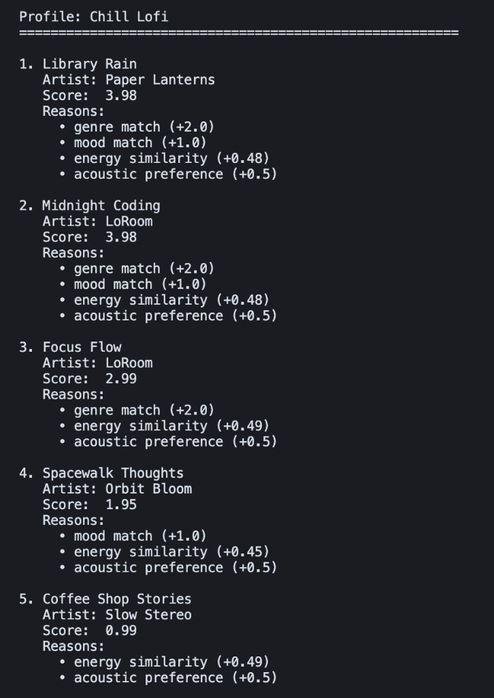
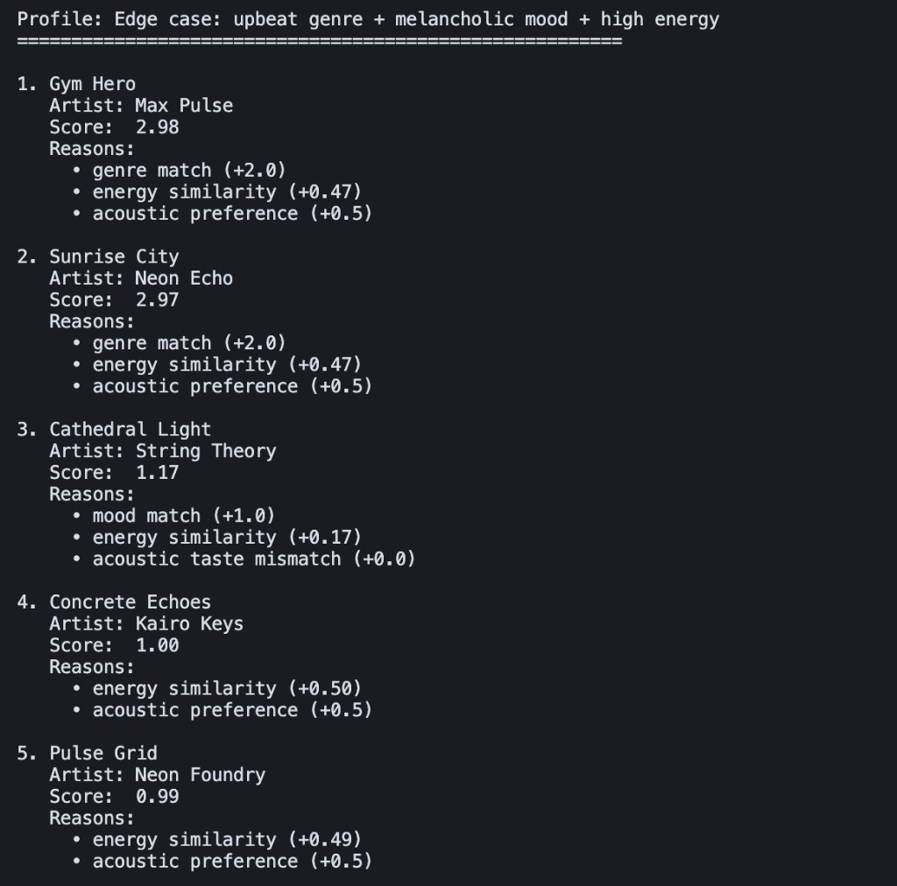
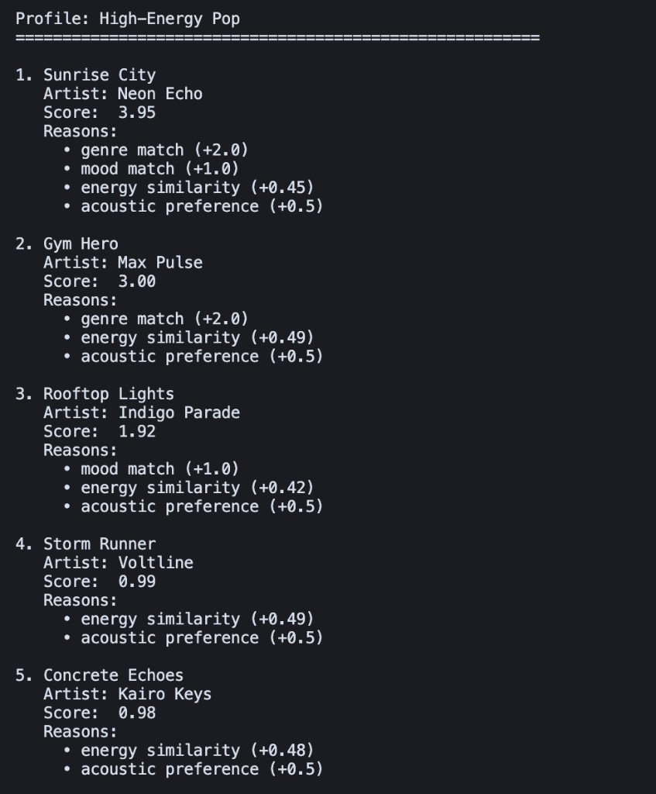
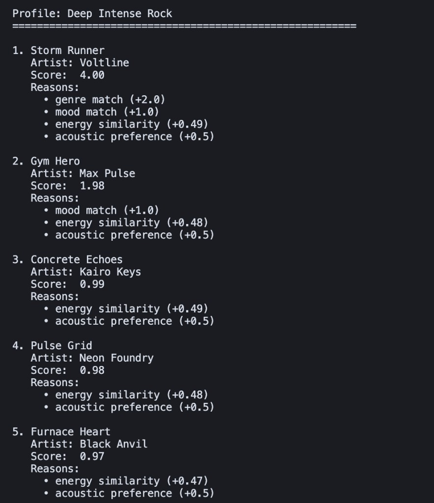

# 🎵 Music Recommender Simulation

## Project Summary

CLI-first simulation: `python -m src.main` loads `data/songs.csv`, scores each track against a preference dict, prints **Loaded songs: N**, then the top *k* rows with numeric scores and per-rule reasons (e.g. `genre match (+2.0)`). The same scoring rules power the `Recommender` class used in unit tests.

---

## How The System Works

**`Song` columns:** `id`, `title`, `artist`, `genre`, `mood`, `energy`, `tempo_bpm`, `valence`, `danceability`, `acousticness`.

**`UserProfile` / CLI dict:** `genre` (or `favorite_genre`), `mood` (or `favorite_mood`), `energy` (or `target_energy`), `likes_acoustic`.

**Scoring:** +2.0 genre, +1.0 mood, `0.5 × (1 − |energy − target|)`, +0.5 when acoustic taste matches (`likes_acoustic` vs `acousticness` threshold 0.5). Reasons include the points awarded for each rule. Optional **`RECOMMENDER_EXPERIMENT=1`**: genre weight halved and energy multiplier doubled (same formula, different weights) to test sensitivity.

**Ranking:** `recommend_songs` builds `(song, score, reasons)` for the whole catalog, then uses **`sorted(..., key=..., reverse=True)`** so the original list is not mutated. **`list.sort()`** sorts in place and returns `None`; **`sorted()`** returns a new list—here we prefer `sorted()` on a small list of tuples to leave `songs` unchanged.

---

## CLI output (multi-profile)

```bash
python3 -m src.main
```

`main.py` runs four profiles (high-energy pop, chill lofi, deep intense rock, and an edge-case mix). For grading you can attach terminal screenshots of this run; the transcript below matches `python3 -m src.main` on the current catalog.

```
Loaded songs: 18
Scoring: baseline

Profile: High-Energy Pop
========================================================

1. Sunrise City
   Artist: Neon Echo
   Score:  3.95
   Reasons:
     • genre match (+2.0)
     • mood match (+1.0)
     • energy similarity (+0.45)
     • acoustic preference (+0.5)

2. Gym Hero
   Artist: Max Pulse
   Score:  3.00
   Reasons:
     • genre match (+2.0)
     • energy similarity (+0.49)
     • acoustic preference (+0.5)

3. Rooftop Lights
   Artist: Indigo Parade
   Score:  1.92
   Reasons:
     • mood match (+1.0)
     • energy similarity (+0.42)
     • acoustic preference (+0.5)

4. Storm Runner
   Artist: Voltline
   Score:  0.99
   Reasons:
     • energy similarity (+0.49)
     • acoustic preference (+0.5)

5. Concrete Echoes
   Artist: Kairo Keys
   Score:  0.98
   Reasons:
     • energy similarity (+0.48)
     • acoustic preference (+0.5)

Profile: Chill Lofi
========================================================

1. Library Rain
   Artist: Paper Lanterns
   Score:  3.98
   Reasons:
     • genre match (+2.0)
     • mood match (+1.0)
     • energy similarity (+0.48)
     • acoustic preference (+0.5)

2. Midnight Coding
   Artist: LoRoom
   Score:  3.98
   Reasons:
     • genre match (+2.0)
     • mood match (+1.0)
     • energy similarity (+0.48)
     • acoustic preference (+0.5)

3. Focus Flow
   Artist: LoRoom
   Score:  2.99
   Reasons:
     • genre match (+2.0)
     • energy similarity (+0.49)
     • acoustic preference (+0.5)

4. Spacewalk Thoughts
   Artist: Orbit Bloom
   Score:  1.95
   Reasons:
     • mood match (+1.0)
     • energy similarity (+0.45)
     • acoustic preference (+0.5)

5. Coffee Shop Stories
   Artist: Slow Stereo
   Score:  0.99
   Reasons:
     • energy similarity (+0.49)
     • acoustic preference (+0.5)

Profile: Deep Intense Rock
========================================================

1. Storm Runner
   Artist: Voltline
   Score:  4.00
   Reasons:
     • genre match (+2.0)
     • mood match (+1.0)
     • energy similarity (+0.49)
     • acoustic preference (+0.5)

2. Gym Hero
   Artist: Max Pulse
   Score:  1.98
   Reasons:
     • mood match (+1.0)
     • energy similarity (+0.48)
     • acoustic preference (+0.5)

3. Concrete Echoes
   Artist: Kairo Keys
   Score:  0.99
   Reasons:
     • energy similarity (+0.49)
     • acoustic preference (+0.5)

4. Pulse Grid
   Artist: Neon Foundry
   Score:  0.98
   Reasons:
     • energy similarity (+0.48)
     • acoustic preference (+0.5)

5. Furnace Heart
   Artist: Black Anvil
   Score:  0.97
   Reasons:
     • energy similarity (+0.47)
     • acoustic preference (+0.5)

Profile: Edge case: upbeat genre + melancholic mood + high energy
========================================================

1. Gym Hero
   Artist: Max Pulse
   Score:  2.98
   Reasons:
     • genre match (+2.0)
     • energy similarity (+0.47)
     • acoustic preference (+0.5)

2. Sunrise City
   Artist: Neon Echo
   Score:  2.97
   Reasons:
     • genre match (+2.0)
     • energy similarity (+0.47)
     • acoustic preference (+0.5)

3. Cathedral Light
   Artist: String Theory
   Score:  1.17
   Reasons:
     • mood match (+1.0)
     • energy similarity (+0.17)
     • acoustic taste mismatch (+0.0)

4. Concrete Echoes
   Artist: Kairo Keys
   Score:  1.00
   Reasons:
     • energy similarity (+0.50)
     • acoustic preference (+0.5)

5. Pulse Grid
   Artist: Neon Foundry
   Score:  0.99
   Reasons:
     • energy similarity (+0.49)
     • acoustic preference (+0.5)
```

**Weight experiment:** `RECOMMENDER_EXPERIMENT=1 python3 -m src.main` — same profiles; genre matches show `+1.0` and energy terms roughly double, so rankings shift toward energy proximity when genre is weaker.

## Screenshots (add your terminal captures)

Save your screenshots in `screenshots/` using these names, then they will render below:

- `screenshots/high-energy-pop.png`
- `screenshots/chill-lofi.png`
- `screenshots/deep-intense-rock.png`
- `screenshots/edge-case-profile.png`






---

## Getting Started

### Setup

1. Create a virtual environment (optional but recommended):

   ```bash
   python -m venv .venv
   source .venv/bin/activate      # Mac or Linux
   .venv\Scripts\activate         # Windows

2. Install dependencies

```bash
pip install -r requirements.txt
```

3. Run the app:

```bash
python -m src.main
```

### Running Tests

Run the starter tests with:

```bash
pytest
```

You can add more tests in `tests/test_recommender.py`.

---

## Experiments You Tried

- **Weight shift:** `RECOMMENDER_EXPERIMENT=1` halves genre points and doubles the energy multiplier; top lists reorder (often more weight on energy closeness).
- **Profiles:** See `reflection.md` for pairwise comparisons.

---

## Limitations and Risks

Summarize some limitations of your recommender.

Examples:

- It only works on a tiny catalog
- It does not understand lyrics or language
- It might over favor one genre or mood

You will go deeper on this in your model card.

---

## Reflection

Read and complete `model_card.md`:

[**Model Card**](model_card.md)

Write 1 to 2 paragraphs here about what you learned:

- about how recommenders turn data into predictions
- about where bias or unfairness could show up in systems like this


---

## 7. `model_card_template.md`

Combines reflection and model card framing from the Module 3 guidance. :contentReference[oaicite:2]{index=2}  

```markdown
# 🎧 Model Card - Music Recommender Simulation

## 1. Model Name

Give your recommender a name, for example:

> VibeFinder 1.0

---

## 2. Intended Use

- What is this system trying to do
- Who is it for

Example:

> This model suggests 3 to 5 songs from a small catalog based on a user's preferred genre, mood, and energy level. It is for classroom exploration only, not for real users.

---

## 3. How It Works (Short Explanation)

Describe your scoring logic in plain language.

- What features of each song does it consider
- What information about the user does it use
- How does it turn those into a number

Try to avoid code in this section, treat it like an explanation to a non programmer.

---

## 4. Data

Describe your dataset.

- How many songs are in `data/songs.csv`
- Did you add or remove any songs
- What kinds of genres or moods are represented
- Whose taste does this data mostly reflect

---

## 5. Strengths

Where does your recommender work well

You can think about:
- Situations where the top results "felt right"
- Particular user profiles it served well
- Simplicity or transparency benefits

---

## 6. Limitations and Bias

Where does your recommender struggle

Some prompts:
- Does it ignore some genres or moods
- Does it treat all users as if they have the same taste shape
- Is it biased toward high energy or one genre by default
- How could this be unfair if used in a real product

---

## 7. Evaluation

How did you check your system

Examples:
- You tried multiple user profiles and wrote down whether the results matched your expectations
- You compared your simulation to what a real app like Spotify or YouTube tends to recommend
- You wrote tests for your scoring logic

You do not need a numeric metric, but if you used one, explain what it measures.

---

## 8. Future Work

If you had more time, how would you improve this recommender

Examples:

- Add support for multiple users and "group vibe" recommendations
- Balance diversity of songs instead of always picking the closest match
- Use more features, like tempo ranges or lyric themes

---

## 9. Personal Reflection

A few sentences about what you learned:

- What surprised you about how your system behaved
- How did building this change how you think about real music recommenders
- Where do you think human judgment still matters, even if the model seems "smart"

